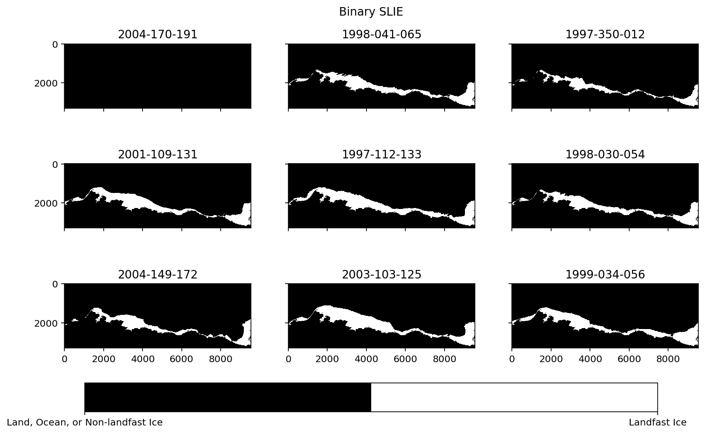
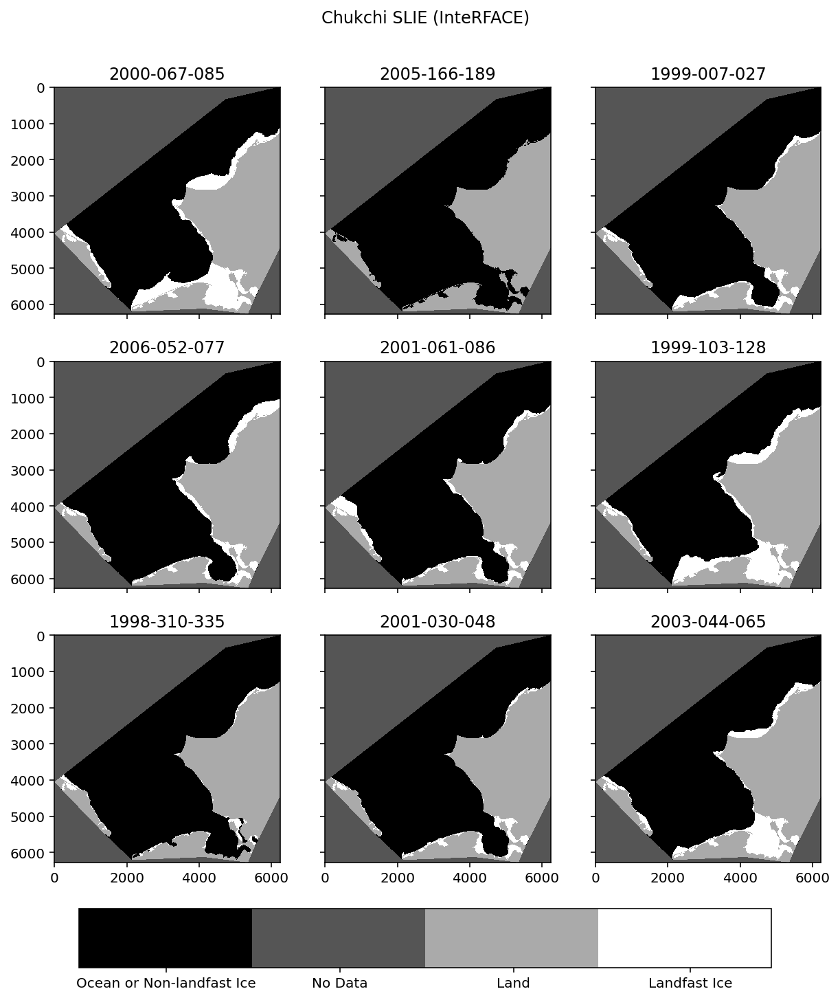
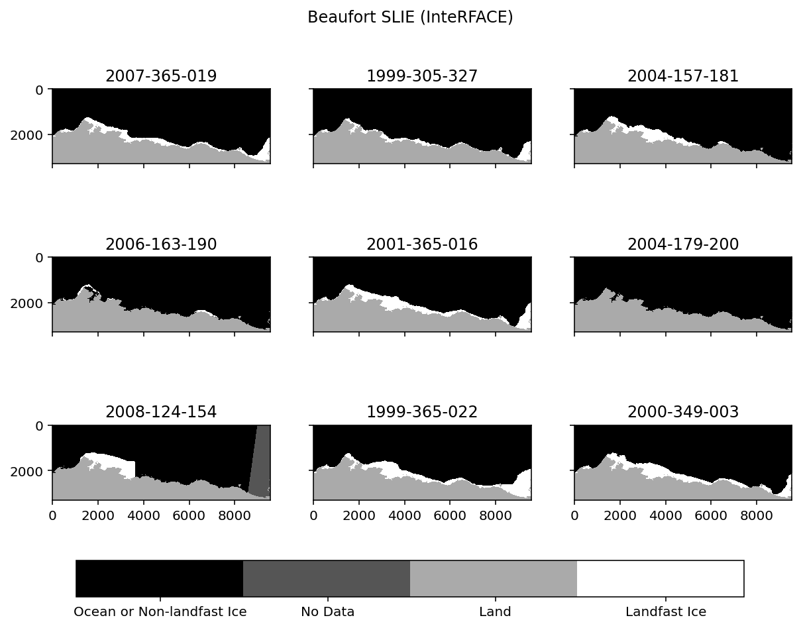

# "The Landfast Sea Ice Data"
## Objective
The purpose of this document is a high-level distillation of the progress made toward collecting, curating, and ingesting "the landfast sea ice data" into the Arctic Data Collaborative (ARDAC). In this document I will describe the data as I understand them and propose a path forward for making these data more broadly accessible and more useful to a wider variety of end-users (i.e., curation).
## Background
An initial exploratory data analysis has been completed for two complementary archives of landfast sea ice data. The first archive are the "Recurring Spring Leads and Landfast Ice in the Beaufort and Chukchi Seas" data that are hosted by the NSIDC[^1]. The second archive are the data preserved locally on the SNAP file system. These data will hereafter be referred to as "ths NSIDC data" and "the InteRFACE data" for brevity. Note that the NSIDC data contain another separate, but related variable: leads. The leads data are intentionally omitted from this discussion, although the data may be brought into a more broadly scoped workflow if it is desriable at some later date.
### What is Landfast Sea Ice?
Landfast ice is sea ice that is mostly stationary and attached to land. This dataset defines landfast ice as being continguous to the coast and lacking detectable motion for approximately 20 days. This defintion is consistent with the defintion provided by Mahoney et al. (2005) and Mahoney et al. (2007), and the landfast sea ice data in these datasets are the same data analyzed by [Mahoney et al. (2007)](https://agupubs.onlinelibrary.wiley.com/doi/abs/10.1029/2006JC003559).
### Why Care About Landfast Sea Ice?
From Mahoney et al. (2007):
>In the Arctic, landfast sea ice is a key element of the coastal system, integral to a wide range of geological and biological processes as well as human activities. The presence of landfast ice can mitigate the effect of winter storms on the coast but also impede navigation in the spring. As well as being of great importance to native subsistence activities [Nelson, 1969; George et al., 2004], the presence or absence of landfast in northern Alaska and its stability are of considerable economic importance for offshore development.
### Source Data Attributes
The landfast ice data are derived from RADARSAT-1 data aquired using the the moderate-resolution ScanSAR operation mode of the synthetic aperture radar (SAR) sensor. The RADARSAT-1 mission (no longer active) used a C-Band (5.3 GHz), 5.6 cm wavelength, HH polarized microwave frequency to image the earth. RADARSAT-1 could "detect" landfast ice because it has a distinct backscatter signature compared to surrounding pack ice, land, or open water. Indiviudal ScarSAR passes were mosaiced together to generate a mosaic evry two or three days resulting in 8 to 35 mosaics per annual ice cycle. Data processing details are provided by [Eicken et al. (2006)](https://nsidc.org/sites/nsidc.org/files/files/data/noaa/g02173/eicken_leads_landfast_2006.pdf).
### Spatial Attributes
The NSIDC data domain encomapsses northern Alaska and northwestern Canada and includes the Beaufort and Chukchi Seas. The InteRFACE data also includes a set of western Chukchi data that include the northwest Arctic Coast and Seward Peninsula that is not included in the NSIDC holdings. The native spatial resolution (i.e., pixel size) of both data sets is 100 m x 100 m. Some small islands are excluded from the analysis - although large islands such as Barter and Herschel Islands are included.
### Temporal Atrributes
Data are characterized by seaonal ice cyles (October to July) that encompass two calendar years, so 1998-1999 is a single ice season.
Eight annnual (1996-2004) seasonal ice cycles are included in the NSIDC data.
Nine (1999-2008) seasonal ice cycles are included in the InteRFACE data for the **Beaufort** region.
Twelve (1996-2008) seasonal ice cycles are included in the InteRFACE data for the **Chukchi** region.

The landfast ice extent detected from a set of three SAR mosaics (spanning ~20 days) are the foundation of both the NSIDC and InteRFACE dataset.
For example, a file named `r1998010-032_slie.tif` is the landfast sea ice classification result for the period spanning day-of-year (DOY) 010, 1998, to DOY 32, 1998 (Jan. 10th to Feb. 1st).

## EDA Results
### NSIDC Data
These data were fetched from the NSIDC FTP service. 225 GeoTIFF files were extracted from the `data/binarized_geotiffs` directory. Each file represents an individual landfast ice exent scene for the year and DOY range indicated by the file name. Note that the [User Guide](https://nsidc.org/sites/default/files/g02173-v001-userguide.pdf) for this dataset refers to landfast ice in a few different ways. The term "Landfast Ice Extent" is used for the binarized GeoTIFFs where values of `255` (white, see Figure 1) indicate landfast ice and values of `0` (black) indicate land, open ocean, or non-landfast ice. However, the term "seaward looking landfast ice edge" (SLIE) is used in the file names and is used extensively by Mahoney et al. (2007) to analyze landfast ice and to compute additional datasets of landfast ice width (LFIW) and water depth at the SLIE and is indicated by vectorized outlines of the landfast ice. Monthly summary (miniumum, mean, median, and maximum landfast ice extent) data are also available from this dataset.

| |
|:--:|
| <i>Figure 1. Nine random samples of the NSIDC landfast ice extent "binarized GeoTIFF" collection. The date of each scene is in the format YYYY-DOY-DOY. The scenes represent the full extent of the NSIDC data, an area spanning the Beaufort coastline of Alaska and a small portion of the Chukchi coastline as well.</i>|

### InteRFACE Data
There are 216 GeoTIFF files for the Chukchi region. A sample of these data appear in Figures 2 and 3. Note that the data values for these scenes are different than what is in the NSIDC data. These data lack a consistent set of unique values across the files. My interpretations are as follows:

 - 0: No SLIE is present for this pixel. This means either water, or sea ice that is not landfast.
 - 63, 64, 111, or some other value between 0 and 128: No data.
 - 128: A landmask. The landmask appears constant across each GeoTiff sampled thus far.
 - 255: Landfast Sea Ice

Monthly statistical summary rasters and annual "stacks" of individual scenes are also available in this dataset.

| |
|:--:|
| <i>Figure 1. Nine random samples of the InteRFACE Chukchi landfast ice extent data. The date of each scene is in the format YYYY-DOY-DOY.</i>|

There are 250 GeoTIFF files for the Beaufort region. A sample of these data is in Figure 2. Note that the data values for these scenes are different than what is in the NSIDC data.

| |
|:--:|
| <i>Figure 1. Nine random samples of the InteRFACE Beaufort landfast ice extent data. The date of each scene is in the format YYYY-DOY-DOY.</i>|

## Recommendation for ARDAC
### Now
In the short-term I recommend we create a unified time index for all sets of data with an eye to identifying what, if any, discrepancies exist between the NSDIC and the InteRFACE-Beaufort datasets. If these data are identical (after prescirbing a common set of catetgorical integer encodings, e.g., 128 is always the landmask) then we can seek to unify these data with the InteRFACE-Chukchi data where there are common time indicies. If there are not common time indicies we can represent that in the ultimate data model as well. The outcome would be for a user to be able to query the dataset by a date or set of dates and retreive an internally consistent set of whatever landfast sea ice data exists for that period.
### Pending
 - Curate monthly summaries of landfast ice extent (e.g., July maximum extent)
 - If desriable, curate and ingest geopsatially referenced versions of the other derived data from Mahoney at al. (2007).
   - Water depth at the SLIE edge
   - Landfast Ice Width
   - Key events
- Curate and ingest the AVHRR "Leads" dataset from the NSDIC data.

## References

[^1] Eicken, H., L. Shapiro, A. G. Gaylord, A. Mahoney, and P. W. Cotter. 2009. Recurring Spring Leads and Landfast Ice in the Beaufort and Chukchi Seas, 1993-2004, Version 1. Boulder, Colorado USA. NSIDC: National Snow and Ice Data Center. doi: https://doi.org/10.7265/N5SB43P0. Accessed July 2022.

>Eicken, H., L. Shapiro, A. G. Gaylord, A. Mahoney, and P. Cotter. 2006. Mapping and Characterization of Recurring Spring Leads and Landfast Ice in the Beaufort and Chukchi Seas. Final Report, Minerals Management Service OCS Study MMS 2005-068.

>Eicken, H., L. Shapiro, A. G. Gaylord, A. Mahoney, and P. W. Cotter. 2009. Recurring Spring Leads and Landfast Ice in the Beaufort and Chukchi Seas, 1993-2004, Version 1. Boulder, Colorado USA. NSIDC: National Snow and Ice Data Center. doi: https://doi.org/10.7265/N5SB43P0. Accessed July 2022.

>Mahoney, A., Eicken, H., Shapiro, L., & Graves, A. (2005). Defining and locating the seaward landfast ice edge in northern Alaska. In 18th International Conference on Port and Ocean Engineering under Arctic Conditions (POAC'05), Potsdam, NY (pp. 991-1001).

>Mahoney, A., Eicken, H., Gaylord, A. G., and Shapiro, L. (2007), Alaska landfast sea ice: Links with bathymetry and atmospheric circulation, <i>J. Geophys. Res.,</i> 112, C02001, doi:10.1029/2006JC003559. 

